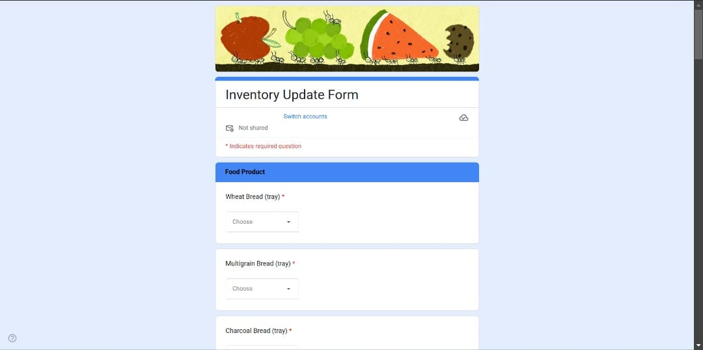
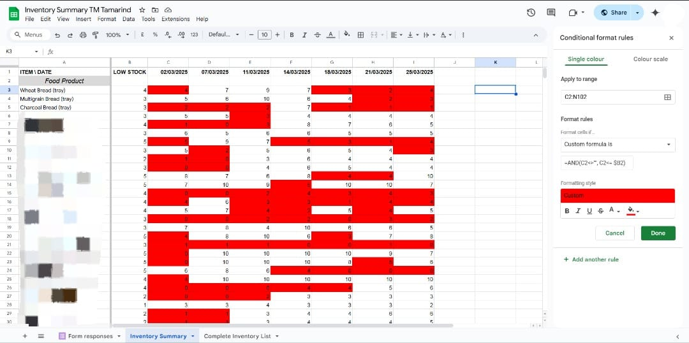

# Inventory Monitoring System 🚀
A system I developed for Toast Maker Tamarind Square branch for stock monitoring. 
Designed to collect inventory data through Google Forms and store it in Google Sheets. 
The system updates a structured summary table automatically using Google Apps Script.

## Features
#### ✅ Employee performs inventory count every Monday and Friday via Google Forms.
#### ✅ Data is stored in a Google Sheet (Form Responses tab).
#### ✅ A script automatically transfers and organizes the data into a structured table in 'Inventory Summary' tab.
#### ✅ Ensures a systematic and transparent tracking of inventory over time.

## Setup & Usage
1. Create your own Google Form and Sheet.
2. Link the Form to store the responses in the Sheet.
3. Add a new tab to organize the form response as desired.
4. Copy the Apps Script into the script editor (Extensions > Apps Script). Ensure 'tab name' matches with yours, and 'starting row' is set accordingly based on how you design your table.
5. Run the script or set a trigger for automatic execution (I set mine to run upon form submission).

## Potential Improvement
🔹 Add an alert system for low stock warnings. Currently I only do conditional formatting where I highlight low stock amounts in red.

## Example
Only sharing snippets of the Google Form and Sheets to respect the company confidentiality.

